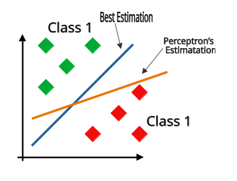

# Perceptron

**Perceptron** (or *single-layer perceptron*) is a supervised learning algorithm developed by [Frank Rosenblatt](https://en.wikipedia.org/wiki/Frank_Rosenblatt) in 1957.  

Perceptron is a binary classification algorithm, which means its objective is to categorize data points into one of two distinct classes, such as 1 or 0, true or false, or positive and negative labels.

The Perceptron learning algorithm is one of the simplest forms of *Artificial Neural Network (ANN)*. In machine learning, Artificial Neural Network, also called a [Neural Network](https://en.wikipedia.org/wiki/Neural_network_(machine_learning)) or Neural Net (NN), is a computational model inspired by the structure and functions of biological neural networks.
## Perceptron terminology in Biological Neural Networks

Inputs (correspondingly $x$) are passed through synapses and received by dendrites. Synaptic strength determines how well the information (or magnitude of the impulse) can be carried (correspondingly $w$). These inputs across all the dendrites are accumulated (correspondingly $\sum$) at the axon hillock via a process called spatial summation. (There is actually a second type of neural summation in biological neurons called temporal summation, but temporal summation relates to Recurrent NNs, not Perceptrons). If this summation exceeds a certain threshold (correspondingly $\theta$), then the neuron gets excited (correspondingly a step activation function), and an output signal is generated that will be passed on by the axon. In the case of binary ANNs, this corresponds to whether the final result after all these processes belongs to a certain class (positive or 1) or not (negative or 0).
  
## Perceptron terminology in Artificial Neural Networks (ANNs)

 

Given the set of input features $x_{1}$, $x_{2}$, ..., $x_{n}$ Perceptron model tries to find corresponding weights $w_{1}$, $w_{2}$, ..., $w_{n}$ which are suitable for mapping input into meaningful output. This process of  learning the model parameters is referred to as **model training**, **model learning**, or simply, **learning**.

$$
\mathbf{x} = \begin{bmatrix} x_1 \\ x_2 \\⋮ \\ x_n \end{bmatrix} \quad \mathbf{w} = \begin{bmatrix} w_1 \\ w_2 \\⋮ \\ w_n \end{bmatrix}
$$
  
  
We define net input *z* by taking *dot product* between features and weights:

$$z = \mathbf{x} \cdot \mathbf{w} = \sum_{i=1}^{n} x_i w_i = x_1w_1 + x_2w_2 + \dots + x_nw_n$$

> This operation yields a scalar value. Note that you can also perform **matrix multiplication** by treating vectors as $n \times 1$ matrices; in fact, in machine learning, it is standard to treat vectors as $n \times 1$ matrices while still referring to them as vectors. To obtain the same scalar result, we transpose the weight vector $\mathbf{w} \in \mathbb{R}^{n \times 1}$ to $\mathbf{w}^T \in \mathbb{R}^{1 \times n}$ and perform matrix multiplication with $\mathbf{x} \in \mathbb{R}^{n \times 1}$, yielding $z = \mathbf{w}^T\mathbf{x}$. As you may recall from Linear Algebra classes, the product of a $1 \times n$ matrix and an $n \times 1$ matrix is a $1 \times 1$ matrix, which can be treated as a scalar value without issue.

Then, we feed the net input into the activation function. There are many types of activation functions such as Sigmoid, Tanh, and ReLU. For the Perceptron algorithm specifically, the activation function is the **unit step function** (also referred to as the **Heaviside step function**). If the net input is greater than the threshold, the model classifies it as 1, and if not, 0. This is the final step in the prediction, and that prediction is called $\hat{y}$ (y-hat):

$$
σ(z) = \begin{cases}
1, & z \ge  \theta \\
0, & otherwise
\end{cases}
$$

> The threshold itself is also learned by the model.
 
To make the implementation more compact, we can bring $\theta$ to the left side:

$$
σ(z) = \begin{cases}
1, & z - \theta \ge 0 \\
0, & otherwise
\end{cases}
$$

At this point, we can define *bias* $b = - \theta$ and make it part of the net input: 

$$
z = \mathbf{x} \cdot \mathbf{w} + b = \sum_{i=1}^{n} x_i w_i + b = x_1w_1 + x_2w_2 + \dots + x_nw_n + b
$$

We can go further and introduce $x_{0}$ and $w_{0}$, and set them to $x_{0}$ = 1 and $w_{0}$ = b. 

As you can see, we changed nothing but showed a clearer representation. Finally, the redefined equation for net input becomes:

$$
z = \mathbf{x} \cdot \mathbf{w} = \sum_{i=0}^{n} x_i w_i = x_0w_0 + x_1w_1 + \dots + x_nw_n
$$

## The Perceptron Learning Rule

1. Initialize the weights (including bias) to very small random numbers .
> Generally, especially for gradient descent-based algorithms (Perceptron is not gradient descent-based), you should do this in order to break symmetry. If you initialize weights to the same number, all the received signals will be the same and the model will get stuck redundantly dealing with a dead learning process. If you initialize weights with zero, which is even worse, there will be no signal at all. In addition to randomization, weights must be initialized to small numbers. This is because, at the first iteration, the net input results in high values, and these values correspond to places in some activation functions like Tanh and Sigmoid where the derivative converges to zero.
2. For each training example, $\mathbf{x}^{(i)}$:

	-  Compute output value,  $\hat{y}^{(i)}$
	- Update the weights, $\mathbf{w}^{(i)}$
	
#### Weight update

The simultaneous update of the  each weight, $w_{j}$, in the weight vector, $\mathbf{w}$, can be more formally written as:

$$w_{j} := w_{j} + \Delta w_{j}$$

The update values (“deltas”) are computed as follows:

$$\Delta w_{j} = η(y^{(i)} - \hat{y}^{(i)})x_{j}^{(i)}$$

Here, $η$ is the learning rate (a constant between 0.0 and 1.0), $y^{(i)}$ is the **true class label** for the $i$-th training sample, and $\hat{y}^{(i)}$ is our **predicted class label** which is found by the activation function defined earlier. In the Perceptron algorithm, the update direction is determined by the prediction error $(y^{(i)} - \hat{y}^{(i)})$ scaled by the input feature $x_j^{(i)}​$, while the learning rate $η$ controls the size of the adjustment step.

Keep in the mind that the weights are updated simultaneously, meaning output $\hat{y}^{(i)}$ is affected after all the weights are updated with same output value, not updated one: 

(note that we can ignore $x_{j}^{(0)}$ for $w_{0}$ because it equals 1)

$$\Delta w_{0} = η(y^{(i)} - output^{(i)})x_{0}^{(i)}$$

$$\Delta w_{1} = η(y^{(i)} - output^{(i)})x_{1}^{(i)} $$

$$\Delta w_{2} = η(y^{(i)} - output^{(i)})x_{2}^{(i)}$$

Now, let's look at how straightforward and beautiful this algorithm is.

Because the Perceptron is a binary classification algorithm, there are 4 outcomes.

#### In the case of true classification: 

(1) $y^{(i)}$ = 0, $\hat{y}^{(i)}$ = 0  $\Delta w_{j} = η(0 - 0)x_{j}^{(i)}$ (no update)

(2) $y^{(i)}$ = 1, $\hat{y}^{(i)}$ = 1  $\Delta w_{j} = η(1 - 1)x_{j}^{(i)}$ (no update)

#### In the case of false classification: 

(3) $y^{(i)}$ = 1, $\hat{y}^{(i)}$ = 0  $\Delta w_{j} = η(1 - 0)x_{j}^{(i)}$ (the model makes the weight bigger, so it will produce bigger value next time, thus more likely to be above the threshold and classify as positive class)

(4) $y^{(i)}$ = 0, $\hat{y}^{(i)}$ = 1  $\Delta w_{j} = η(0 - 1)x_{j}^{(i)}$ (the model makes the weight smaller, so it will produce smaller value next time, thus more likely to be below the threshold and classify as negative class)

> Multiplying by $x_{j}^{(i)}$ makes sense actually. It helps to  move the decision boundary in the direction of the misclassified point while keeping the scale balanced.
## Additional Notes

Perceptron algorithm is guaranteed to converge if the data is linearly separable (in other words, you can draw a straight line between two classes without misclassifying any data point). While the Perceptron algorithm is guaranteed to converge on _some_ solution in the case of a linearly separable training set, it may still pick _any_ solution and problems may admit many solutions of varying quality. Meaning, it may not be the best solution; as soon as it draws a straight line correctly, it will not improve it further.

It is important to shuffle data before each epoch, so model is introduced different batch everytime.

Although the Perceptron is a binary classification algorithm, certain techniques exist, such as One-vs-Rest (OvR), also known as One-versus-All (OvA), to transform the Perceptron algorithm into a multi-class classifier.

### To-Do 
- [ ] Add shuffling data before every epoch
- [ ] Build One-vs-Rest

